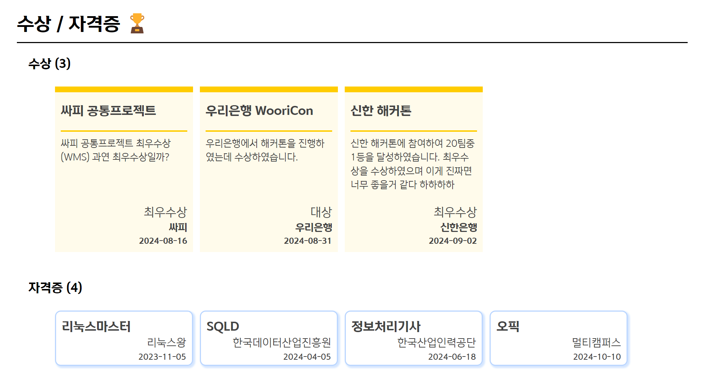
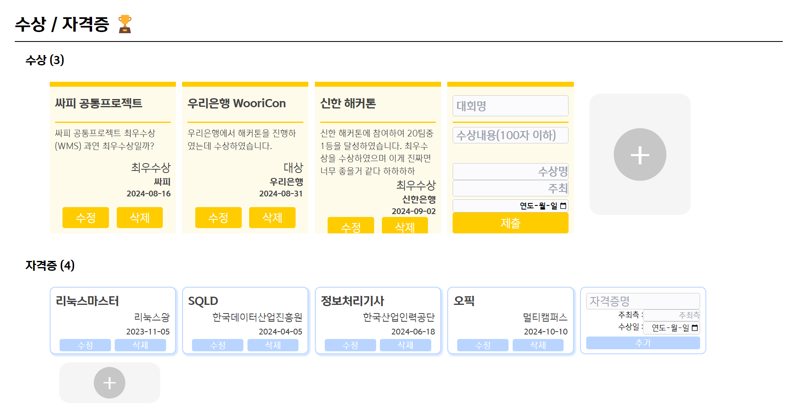

# 📈 SOL 학생 로드맵 - Front-end

```git
⚡ 2024.08.16 ~ 2024.08.31
```

&nbsp;&nbsp; <strong>SOL 학생 로드맵: </strong>
학생/선후배 life 여정 Data 기반으로 포트폴리오와 모범 금융 로드맵을 제공하는 고객 락인(Lock-in) 금융 플랫폼
<br />

- [메인화면 원형 스크롤](https://github.com/team-conSOLtant/Frontend/blob/main/README.md#1-%EB%A9%94%EC%9D%B8%ED%99%94%EB%A9%B4-%EC%9B%90%ED%98%95-%EC%8A%A4%ED%81%AC%EB%A1%A4)

## ⭐ Using Stacks <br/>

```git
📌 React, Redux, chart.js, Gemini API, Vite, HTML, CSS, Tailwind, Styled Components,JavaScript, axios
```

### &nbsp;&nbsp; React 사용 이유<br />

> ▪️ SPA(Single Page Applicatione)로 구조가 가벼운 반응형 시스템 제공 <br/>
> ▪️ JSX를 사용하여 컴포넌트 커스터마이징이나 자유도 면에서 Vue의 템플릿보다 확장성이 좋음

### &nbsp;&nbsp; Chart.js 사용 이유<br />

> ▪️

<br />

## 1. 메인화면 원형 스크롤

>

<div align="center">
      
</div>
<br />

### 기능

- 마우스 스크롤 이벤트로 원형 메뉴 자동 이동 기능
- 메뉴 이동에 따라 다른 페이지 렌더링
- 메뉴 이동에 따라 전체 메인 페이지 테마 색 적용

### 구현방법 :

> 화면 크기에 따른 원 지름(Radius) 계산 및 설정

```js
const [radius, setRadius] = useState(0); // 반지름을 상태로 관리

useEffect(() => {
  updateRadius(); // 초기 반지름 설정
  window.addEventListener("resize", updateRadius); // 화면 크기 변경 시 반지름 업데이트
  return () => window.removeEventListener("resize", updateRadius);
}, []);

const updateRadius = () => {
  const newRadius = window.innerWidth * 0.57; // 화면 크기에 맞게 반지름 설정
  console.log("Calculated radius:", newRadius); // radius 값을 확인하기 위해 로그 추가
  if (newRadius < 675) {
    setRadius(675);
  } else {
    setRadius(newRadius);
  }
};
```

<br />

> 원 지름에 따른 메뉴 위치 설정

```js
{
  /* 원형 스크롤 구현 */
}
{
  infos &&
    infos.map((info, index) => {
      const angleStep = Math.PI / 36;
      const itemAngle = (index - infos.length + 1) * angleStep;
      const x = (radius + 90) * Math.cos(itemAngle);
      const y = (radius + 90) * Math.sin(itemAngle);

      return (
        <div
          key={index}
          className={`absolute rounded-full bg-white shadow-lg flex justify-center items-center transition-transform ease-out duration-300`}
          style={{
            width: `${radius * 2}px`, // radius를 기준으로 width 설정
            height: `${radius * 2}px`, // radius를 기준으로 height 설정
            transform: `rotate(${angle}deg)`,
            left: "-25rem", // 원래 중심 위치로 유지
            boxShadow: `0px 0px 15px ${infos[itemIndex].rgba}`, // 현재 인덱스에 따른 그림자 색상 적용
          }}
        >
          <div
            key={index}
            className={`absolute flex justify-center items-center transition-transform ease-out duration-300`}
            style={{
              width: "10rem",
              height: "3rem",
              transform: `translate(${x}px, ${y}px) rotate(${itemAngle}rad)`,
            }}
          ></div>
        </div>
      );
    });
}
```

> 스크롤 이벤트 감지에 따라 index값 변경

```js
const handleScroll = (event) => {
  // infos가 존재하지 않으면 handleScroll 실행 안 함
  if (!infos || !infos.length) return;

  const scrollableDiv = document.querySelector(".scrollable-container");
  if (scrollableDiv && scrollableDiv.contains(event.target)) {
    return; // 스크롤이 특정 컨테이너 내에서 발생하면, 부모의 스크롤 이벤트를 무시
  }

  if (event.deltaY > 0) {
    // Scroll down (upward movement in UI)
    if (itemIndex > 0) {
      setAngle((prevAngle) => prevAngle + 5);
      setItemIndex((prevIndex) => prevIndex - 1);
    }
  } else {
    // Scroll up (downward movement in UI)
    if (itemIndex < infos.length - 1) {
      setAngle((prevAngle) => prevAngle - 5);
      setItemIndex((prevIndex) => prevIndex + 1);
    }
  }
};

useEffect(() => {
  window.addEventListener("wheel", handleScroll);
  return () => {
    window.removeEventListener("wheel", handleScroll);
  };
}, [itemIndex, infos]);
```

<br/>

## 2. 컴포넌트 재활용

- 각 Section 내의 Item, Form 컴포넌트를 재활용하여 코드 유지보수성을 높였습니다.

### PortfolioPage.jsx



### MakePortfolioPage.jsx



## 3. DTO를 이용한 어댑터 패턴 구현

- DTO를 이용한 데이터 양식을 일관화하였습니다.
- 이를 통해 코드 읽기에 용이하고, 추후 유지 보수에도 도움이 될 것으로 예측됩니다.

### DTO 파일 구조

```bash
/dto
  ├── ActivityDTO.js
  ├── AwardDTO.js
  ├── CareerDTO.js
  ├── CertificationDTO.js
  ├── CourseDTO.js
  ├── ProjectDTO.js
  ├── ProjectContentDTO.js
  ├── ProjectLanguageDTO.js
  └── ProjectUserDTO.js
```

### 예시

#### ActivityDTO

```js
export default class ActivityDTO {
  static lastKey = 0;
  constructor(
    activityId = null,
    portfolioId = null,
    title = null,
    content = null,
    startDate = null,
    endDate = null,
    activityType = null,
    contentTitle = null
  ) {
    this.key = ActivityDTO.lastKey++;
    this.activityId = activityId;
    this.portfolioId = portfolioId;
    this.title = title;
    this.content = content;
    this.startDate = startDate;
    this.endDate = endDate;
    this.activityType = activityType;
    this.contentTitle = contentTitle;
  }
}
```

#### AwardDTO

```js
export default class AwardDTO {
  static lastKey = 0;
  constructor(
    awardId = null,
    portfolioId = null,
    title = null,
    content = null,
    awardGrade = null,
    awardOrganization = null,
    acquisitionDate = null
  ) {
    this.key = AwardDTO.lastKey++;
    this.awardId = awardId;
    this.portfolioId = portfolioId;
    this.title = title;
    this.content = content;
    this.awardGrade = awardGrade;
    this.awardOrganization = awardOrganization;
    this.acquisitionDate = acquisitionDate;
  }
}
```

### 빌드 및 실행 방법

서비스는 [https://consoltant.site](https://consoltant.site/) 에 배포되어 있습니다.

```
npm install
npm start
```
